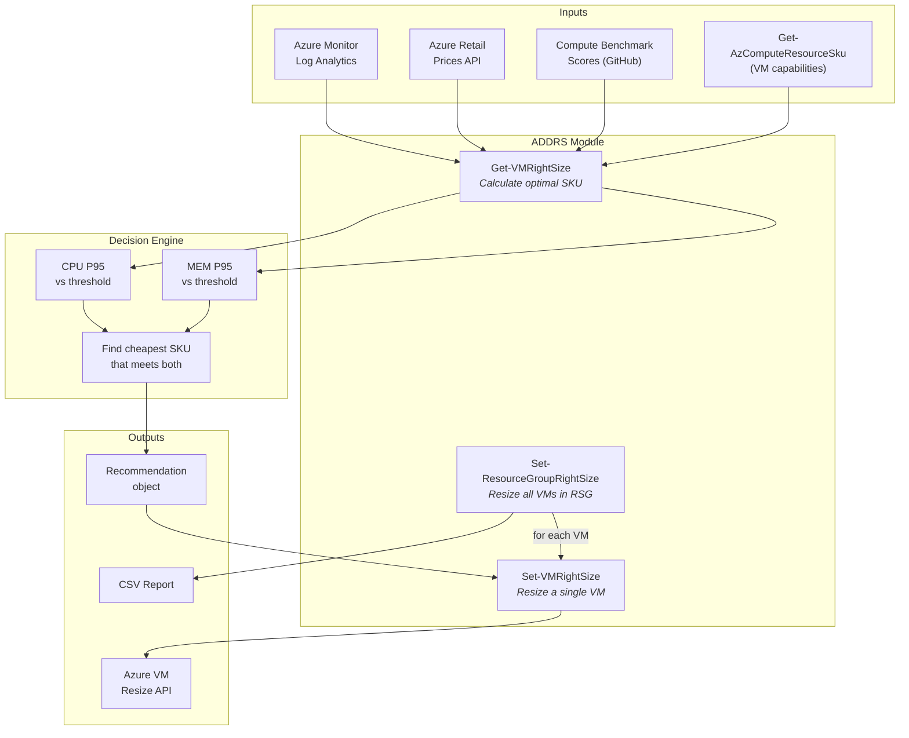
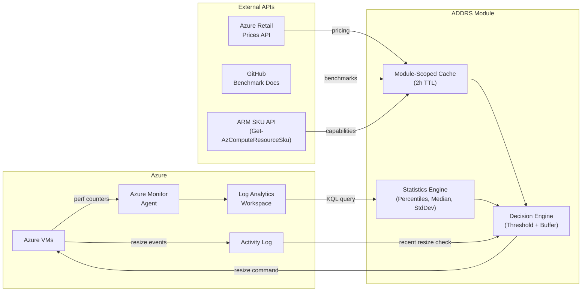

# ADDRS — Azure Dynamic Desktop Right Sizing

Automatically right-sizes Azure VMs based on CPU/memory telemetry from Azure Monitor, combined with Azure Retail Prices API data and compute benchmark scores. Designed with Azure Virtual Desktop (AVD) session hosts in mind, but works for any Azure VM.

## How It Works



## Features

- **Telemetry-driven**: Uses actual CPU and memory performance counters from Azure Monitor (95th percentile)
- **Cost-optimized**: Selects the cheapest VM SKU that meets the calculated requirements
- **Benchmark-aware**: Incorporates CoreMark/Geekbench scores as a tiebreaker when comparing SKUs
- **Oscillation prevention**: Configurable hysteresis buffer prevents VMs from being resized back and forth
- **Safe by default**: Native `-WhatIf` / `-Confirm` support; recent-resize protection
- **Tag overrides**: Set `LCRightSizeConfig` Azure Tag to `disabled` or a specific VM size to control behavior per-VM
- **Maintenance windows**: Exclude performance data collected during maintenance from analysis
- **Reporting**: Optional CSV report generation with cost impact analysis

## Prerequisites

| Requirement | Minimum Version |
|---|---|
| PowerShell | 7.0+ |
| Az.Compute | 7.0.0 |
| Az.OperationalInsights | 3.2.0 |
| Az.Resources | 7.0.0 |
| Az.Accounts | 3.0.0 |

### Azure Resources

- **Log Analytics Workspace** with performance counters enabled:
  - `Available MBytes` or `Available Bytes` (memory)
  - `% Processor Time` (CPU)
- VMs must be sending perf data to this workspace (via Azure Monitor Agent or legacy Log Analytics Agent)

## Installation

### From PowerShell Gallery (when published)

```powershell
Install-Module -Name ADDRS -Scope CurrentUser
```

### Manual Installation

```powershell
# Clone the repository
git clone https://gitlab.com/Lieben/assortedFunctions.git
cd assortedFunctions/ADDRS

# Import the module
Import-Module ./ADDRS.psd1

# Verify
Get-Module ADDRS
```

### Install Az Dependencies

```powershell
Install-Module Az.Compute, Az.OperationalInsights, Az.Resources, Az.Accounts -Scope CurrentUser
```

## Quick Start

```powershell
# Authenticate to Azure
Connect-AzAccount

# Find your Log Analytics workspace ID
$workspace = Get-AzOperationalInsightsWorkspace -ResourceGroupName 'rg-monitoring' -Name 'la-workspace'
$workspaceId = $workspace.CustomerId

# Preview what would happen (no changes made)
Set-VMRightSize -Name 'avd-vm-01' -WorkspaceId $workspaceId -WhatIf -Verbose

# Actually resize (with auto-shutdown and auto-boot)
Set-VMRightSize -Name 'avd-vm-01' -WorkspaceId $workspaceId -Force -Boot

# Resize all VMs in a resource group with a report
Set-ResourceGroupRightSize -ResourceGroupName 'rg-avd-we-01' -WorkspaceId $workspaceId -Force -Report
```

## Functions

### Get-VMRightSize

Calculates the optimal VM size without making any changes. Returns a recommendation object.

```powershell
$rec = Get-VMRightSize -Name 'avd-vm-01' -WorkspaceId $workspaceId -Verbose

# Output properties:
# VMName, CurrentSize, RecommendedSize, Status, CostImpactPercent,
# CPUUsageP95, MemoryUsageP95, Reason
```

**Status values:**
| Status | Meaning |
|---|---|
| `Recommendation` | A resize is recommended |
| `AlreadyOptimal` | VM is already at the best size |
| `Disabled` | Right-sizing disabled via Azure Tag |
| `OverriddenByTag` | Fixed size set via Azure Tag |
| `RecentlyResized` | VM was resized within the lookback period |
| `InsufficientData` | Not enough performance data |
| `Error` | An error occurred (see Reason) |

### Set-VMRightSize

Calculates the optimal size and performs the resize. Supports `-WhatIf`, `-Confirm`, `-Force`, `-Boot`.

```powershell
# Dry run with verbose output
Set-VMRightSize -Name 'avd-vm-01' -WorkspaceId $wsId -WhatIf -Verbose

# Resize with confirmation prompt
Set-VMRightSize -Name 'avd-vm-01' -WorkspaceId $wsId -Force -Confirm

# Resize with auto-shutdown and auto-boot, no confirmation
Set-VMRightSize -Name 'avd-vm-01' -WorkspaceId $wsId -Force -Boot -Confirm:$false
```

### Set-ResourceGroupRightSize

Resizes all VMs in a resource group. Same parameters as `Set-VMRightSize` plus `-Report` and `-ReportPath`.

```powershell
# Dry-run all VMs
Set-ResourceGroupRightSize -ResourceGroupName 'rg-avd-we-01' -WorkspaceId $wsId -WhatIf -Verbose

# Resize all with CSV report
Set-ResourceGroupRightSize -ResourceGroupName 'rg-avd-we-01' -WorkspaceId $wsId -Force -Report

# Custom report path
Set-ResourceGroupRightSize -ResourceGroupName 'rg-avd-we-01' -WorkspaceId $wsId -Force -Report -ReportPath 'C:\Reports\rightsize.csv'
```

## Configuration

### Key Parameters

| Parameter | Default | Description |
|---|---|---|
| `-Region` | `westeurope` | Azure region for pricing/availability |
| `-CurrencyCode` | `USD` | Currency for pricing (USD, EUR, GBP, etc.) |
| `-LookbackHours` | `168` (7 days) | Hours of performance data to analyze |
| `-CPUThreshold` | `0.75` | CPU utilization trigger (75%) |
| `-MemoryThreshold` | `0.75` | Memory utilization trigger (75%) |
| `-BufferPercent` | `0.10` | Hysteresis buffer (10%) to prevent oscillation |
| `-MinvCPUs` | `2` | Minimum vCPU count (2 required for accelerated networking) |
| `-MaxvCPUs` | `64` | Maximum vCPU count |
| `-MinMemoryGB` | `2` | Minimum memory allocation |
| `-MaxMemoryGB` | `512` | Maximum memory allocation |
| `-DefaultSize` | (none) | Fallback size when data is insufficient |

### Default Allowed VM Sizes

The module defaults to D-series (general purpose) and E-series (memory optimized) in v5 and v6:

```
Standard_D2ds_v5,  Standard_D4ds_v5,  Standard_D8ds_v5,  Standard_D16ds_v5
Standard_D2ds_v6,  Standard_D4ds_v6,  Standard_D8ds_v6,  Standard_D16ds_v6
Standard_E2ds_v5,  Standard_E4ds_v5,  Standard_E8ds_v5,  Standard_E16ds_v5
Standard_E2ds_v6,  Standard_E4ds_v6,  Standard_E8ds_v6,  Standard_E16ds_v6
```

Override with `-AllowedSizes`:

```powershell
Set-VMRightSize -Name 'vm01' -WorkspaceId $wsId -AllowedSizes @(
    'Standard_D2as_v5', 'Standard_D4as_v5', 'Standard_D8as_v5'
) -Force
```

### Azure Tag Override

Set the `LCRightSizeConfig` tag on any VM to control behavior:

| Tag Value | Behavior |
|---|---|
| `disabled` | Skip this VM entirely |
| `Standard_D4ds_v5` | Force this specific size |

## Required Azure Permissions

### Minimum RBAC Role

**Virtual Machine Contributor** on the target VMs/resource groups, plus:

| Permission | Purpose |
|---|---|
| `Microsoft.Compute/virtualMachines/read` | Read VM metadata |
| `Microsoft.Compute/virtualMachines/write` | Resize VMs |
| `Microsoft.Compute/virtualMachines/start/action` | Start VMs (-Boot) |
| `Microsoft.Compute/virtualMachines/powerOff/action` | Stop VMs (-Force) |
| `Microsoft.Compute/virtualMachines/deallocate/action` | Deallocate VMs |
| `Microsoft.Compute/skus/read` | List available VM sizes |
| `Microsoft.OperationalInsights/workspaces/query/read` | Query Log Analytics |
| `Microsoft.Insights/eventtypes/values/read` | Read Activity Log |

### Custom Role Definition

```json
{
  "Name": "ADDRS Right-Sizer",
  "Description": "Allows ADDRS module to analyze and resize VMs",
  "Actions": [
    "Microsoft.Compute/virtualMachines/read",
    "Microsoft.Compute/virtualMachines/write",
    "Microsoft.Compute/virtualMachines/start/action",
    "Microsoft.Compute/virtualMachines/powerOff/action",
    "Microsoft.Compute/virtualMachines/deallocate/action",
    "Microsoft.Compute/skus/read",
    "Microsoft.OperationalInsights/workspaces/query/read",
    "Microsoft.Insights/eventtypes/values/read"
  ],
  "AssignableScopes": ["/subscriptions/{subscription-id}"]
}
```

## Architecture Overview



## Data Flow

1. **Collect** — The module queries Log Analytics for CPU (`% Processor Time`) and memory (`Available MBytes` / `Available Bytes`) counters over the lookback period.

2. **Analyze** — Performance statistics are computed (min, max, average, percentiles P1–P99, standard deviation). The 95th percentile is used for sizing decisions.

3. **Decide** — CPU and memory usage are compared against configurable thresholds (default 75%) with a 10% buffer:
   - Above threshold + buffer → scale up
   - Below threshold - buffer → scale down
   - In the buffer zone → no change (prevents oscillation)

4. **Select** — From the allowed VM sizes, the cheapest SKU that meets both CPU and memory requirements is selected, using benchmark scores as a tiebreaker.

5. **Apply** — If `-WhatIf` is not specified, the VM is optionally stopped, resized, and optionally restarted.

## Performance & Caching

- **VM size data** and **pricing data** are cached in module scope for 2 hours (configurable via `$script:CacheTTLMinutes`)
- Uses `[System.Collections.Generic.List[T]]` for O(n) collection building (vs O(n²) with array `+=`)
- `Get-AzComputeResourceSku` (preferred) provides richer SKU data; falls back to `Get-AzVMSize` automatically
- Benchmark score parsing handles both Windows and Linux benchmark pages

## Upgrading from v1.x

### Breaking Changes

| v1.x | v2.0 | Migration |
|---|---|---|
| PowerShell 5.0+ | PowerShell 7.0+ | Upgrade PS runtime |
| Custom `-WhatIf` switch | Native `ShouldProcess` | Same usage, but now works with `$WhatIfPreference` |
| `set-rsgRightSize` | `Set-ResourceGroupRightSize` | Old name works as alias |
| `$global:azureVMPrices` | Module-scoped cache | No action needed |
| `-measurePeriodHours` | `-LookbackHours` | Old name: use `-LookbackHours` |
| `$allowedVMTypes` | `-AllowedSizes` | Old name: use `-AllowedSizes` |
| Returns `$True/$False` | Returns report object with `-Report` | Check `$result.Resized` |

### Backward Compatibility

The following aliases are created for backward compatibility:
- `get-vmRightSize` → `Get-VMRightSize`
- `set-vmRightSize` → `Set-VMRightSize`
- `set-rsgRightSize` → `Set-ResourceGroupRightSize`

Parameter aliases are also provided:
- `-TargetVMName` → `-Name`
- `-TargetRSG` → `-ResourceGroupName`

## Troubleshooting

### No performance data returned

- Verify the VM is sending perf data to Log Analytics: run a manual KQL query in the Azure Portal
- Check that `Available MBytes` or `Available Bytes` and `% Processor Time` counters are configured
- Ensure the Azure Monitor Agent (or legacy LA agent) is installed and connected
- Verify the workspace ID is the `CustomerId` GUID (not the resource ID)

### VM was recently resized

By default, the module skips VMs that were resized within the lookback period. Override with:
```powershell
Set-VMRightSize -Name 'vm01' -WorkspaceId $wsId -DoNotCheckForRecentResize -Force
```

### Allowed sizes not available

If no allowed sizes match, the module returns an error. Check:
- The VM sizes exist in your region: `Get-AzComputeResourceSku -Location westeurope | Where-Object { $_.ResourceType -eq 'virtualMachines' }`
- The sizes are not restricted for your subscription
- Pricing data exists for those sizes in the Azure Retail Prices API

### Cache issues

Force-refresh cached data by reimporting the module:
```powershell
Remove-Module ADDRS -Force
Import-Module ./ADDRS.psd1
```

## Azure Automation Runbook Example

```powershell
# Connect using Managed Identity
Connect-AzAccount -Identity

# Import module (must be uploaded to Automation Account)
Import-Module ADDRS

# Right-size all AVD session hosts during off-hours
$params = @{
    ResourceGroupName           = 'rg-avd-we-01'
    WorkspaceId                 = 'e32b3dbe-2850-4f88-9acb-2b919cce4126'
    Region                      = 'westeurope'
    Force                       = $true
    Boot                        = $true
    Report                      = $true
    ReportPath                  = 'C:\Temp\rightsize-report.csv'
    MaintenanceWindowStartHour  = 22
    MaintenanceWindowDurationHours = 4
    MaintenanceWindowDay        = 6  # Saturday
    LookbackHours               = 336  # 2 weeks
    AllowedSizes                = @(
        'Standard_D2ds_v5', 'Standard_D4ds_v5', 'Standard_D8ds_v5',
        'Standard_E2ds_v5', 'Standard_E4ds_v5', 'Standard_E8ds_v5'
    )
}

Set-ResourceGroupRightSize @params
```

## License

[Commercial use policy](https://www.lieben.nu/liebensraum/commercial-use/) — Free to use and modify for non-commercial purposes as long as headers and attribution are kept intact. Commercial use requires prior written consent.

## Contributing

Contributions are welcome. Please:

1. Fork the repository
2. Create a feature branch
3. Test with `-WhatIf -Verbose` against real VMs
4. Submit a pull request

## Links

- **Blog post**: [Automatic modular rightsizing of Azure VMs](https://www.lieben.nu/liebensraum/2022/05/automatic-modular-rightsizing-of-azure-vms-with-special-focus-on-azure-virtual-desktop/)
- **Repository**: [GitLab — assortedFunctions/ADDRS](https://gitlab.com/Lieben/assortedFunctions/-/tree/master/ADDRS)
- **Azure Retail Prices API**: [Microsoft Docs](https://learn.microsoft.com/en-us/rest/api/cost-management/retail-prices/azure-retail-prices)
- **Azure VM Sizes**: [Microsoft Docs](https://learn.microsoft.com/en-us/azure/virtual-machines/sizes)
- **Azure Monitor Agent**: [Microsoft Docs](https://learn.microsoft.com/en-us/azure/azure-monitor/agents/agents-overview)
