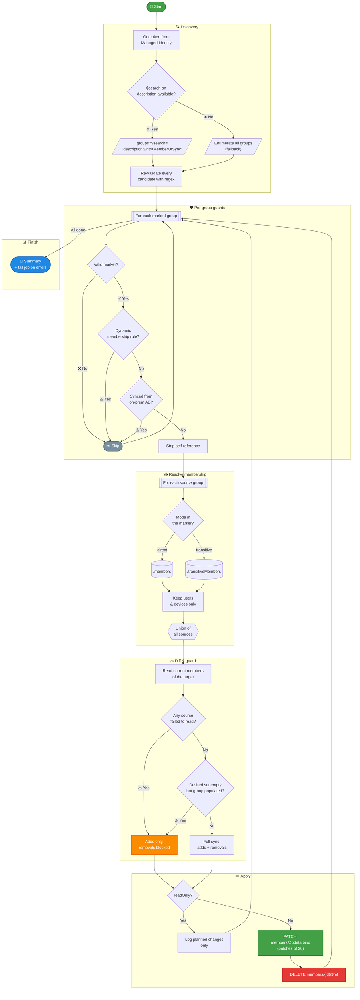

# EntraMemberOfSync

A drop-in replacement for the deprecated Entra ID dynamic group **memberOf** feature.

Microsoft is retiring dynamic membership rules of the form `user.memberOf -any (group.objectId -in ['guid','guid'])`. 

`Invoke-Sync.ps1` takes over that job as a scheduled Azure Automation runbook: it keeps a target group's membership equal to the union of one or more source groups.

No dependencies and free to use. Uses a Managed Identity, direct Graph calls, and a marker in the description of the group you want managed, so the configuration stays visible in the portal right next to the group it governs.

It also does something the deprecated feature never could: **per group** you decide whether source groups are read as direct members or transitively, so nested source groups can be resolved.

## How It Works



## Marker Syntax

Put the marker in the **description of the target group**, the group whose membership you want managed. It may sit anywhere in the text, is case insensitive, and tolerates whitespace around the colons and commas.

| Marker | Effect |
| --- | --- |
| `EntraMemberOfSync:<guid>[,<guid>...]` | Direct members of the source groups. This is the default and matches the old memberOf behaviour. |
| `EntraMemberOfSync:direct:<guid>[,<guid>...]` | Identical, spelled out for clarity. |
| `EntraMemberOfSync:transitive:<guid>[,<guid>...]` | Transitive members, so users inside nested source groups are included too. |

A realistic description:

```
Visio license group. Managed by IT, do not edit members by hand.
EntraMemberOfSync:transitive: 2f1a7c44-9d3e-4b0a-8f61-1c9e0a5b7d22, 9c40b1e8-77af-4d2c-b3a9-5e8f6d1a0c34
```

You can use more than one marker in a single description, each with its own mode. The results are combined:

```
EntraMemberOfSync:direct:2f1a7c44-9d3e-4b0a-8f61-1c9e0a5b7d22
EntraMemberOfSync:transitive:9c40b1e8-77af-4d2c-b3a9-5e8f6d1a0c34
```

The mode applies to how **source** groups are read. The target group's own membership is always read and written as direct members.

Only **user and device** objects are synced. A nested group or service principal found inside a source group is ignored, which also means the runbook will never remove a group or service principal that you assigned to the target group directly.

## Setup

1. Create or reuse an Azure Automation account and enable its **system assigned Managed Identity**.
2. Grant that identity the Graph application permission **`GroupMember.ReadWrite.All`**. The quickest way is https://lieben.nu/tools/SPNRoleMgr. This single permission covers listing groups, reading descriptions, and reading and writing members.
3. Import `Invoke-Sync.ps1` as a PowerShell runbook and publish it. There are no module dependencies, so nothing needs to be imported into the account.
4. Run it once with `-readOnly` and read the output carefully before going live.
5. Link a schedule. Hourly is a sensible default.

### Parameters

| Parameter | Default | Purpose |
| --- | --- | --- |
| `-readOnly` | off | Dry run. Reports every addition and removal it would make, writes nothing. |
| `-markerKeyword` | `EntraMemberOfSync` | The keyword to look for in descriptions. Change it to run two independent populations, or to use your own naming. |

## Migrating from a memberOf dynamic group

1. Open the dynamic group and copy the group GUIDs out of the existing rule (`user.memberOf -any (group.objectId -in [...])`).
2. Change the group's membership type from **Dynamic** to **Assigned**. Entra keeps the members that are currently in the group, so nothing is lost in the switchover, and the runbook is skipped for groups that still carry a dynamic rule.
3. Add `EntraMemberOfSync:<those guids>` to the group's description. Use `direct` (or leave the mode out) to reproduce the old behaviour exactly. Use `transitive` if you also want members of groups nested inside those sources, which the old rule could not do.
4. Run the runbook with `-readOnly` and confirm the reported changes are what you expect. Right after a conversion the difference should be zero or very small.
5. Enable the schedule.

Repeat per group. There is nothing to register centrally, the runbook picks up any newly marked group on its next run.

## Safety guards

- Groups that still have a dynamic membership rule are skipped, with a message telling you to convert them first.
- Groups synced from on premises Active Directory are skipped, since AD Connect owns their membership.
- A group that lists itself as a source has that entry stripped.
- If **any** source group cannot be read during a run, all removals for that target are cancelled for that run. Additions from the sources that did respond still happen. A transient Graph failure can therefore never empty a production group.
- If the calculated membership is empty while the target still has members, removals are cancelled as well. Clear the group by hand if that is genuinely what you want.
- Throttling (429) and transient server errors are retried up to five times, honouring `Retry-After`.
- If any group fails to process, the runbook still finishes the rest and then throws, so the Automation job ends in **Failed** status and your alerting picks it up.

## Logging

The runbook deliberately splits its messages over two Automation streams:

- **Output** carries the normal narrative: the run header, the candidate count, one line per synced group, and the closing summary.
- **Warning** carries everything that deserves attention: throttling retries, the search fallback, unreadable source groups, cancelled removals, self references, and individual add or remove failures.

That split is not cosmetic. In PowerShell a function's return value travels the output stream, so anything a value-returning function writes with `Write-Output` ends up inside the caller's variable. `Get-MarkedGroups` returning a group list, or `Add-GroupMembers` returning a count, must therefore stay silent on that stream. Keep this in mind if you extend the script: log from the main body with `Write-Output`, and from inside a function with `Write-Warning`.

A practical benefit is that "did anything need attention" is a single glance at the Warnings of the job, and you can alert on the warning count without parsing the output text.

## Limitations

- Membership follows on a schedule, so changes land within the sync interval rather than instantly.
- Only union-of-groups semantics. Other dynamic rule expressions (department, country, extension attributes) are out of scope, keep using regular dynamic groups for those.
- Roughly 25 source groups per target, because a group description caps out at 1024 characters.
- Users and devices only.
- Discovery goes through the Graph search index, which is eventually consistent. A freshly marked group can take a few minutes to be picked up, which is irrelevant at an hourly cadence.
- A marked group used as a source for another marked group converges over successive runs rather than within a single run.
