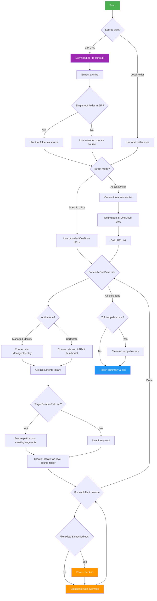

# ProvisionFolder

Provisions a folder structure (from local disk or a remote ZIP URL) into one or more OneDrive for Business sites using PnP authentication (Managed Identity or certificate-based).

Files are uploaded into the **Documents** library — either at the root or under a specific relative path. Existing files are **forcibly overwritten**, even when checked out or locked.

## How It Works



### Technical Details

| Aspect | Approach |
|---|---|
| **Authentication** | Managed Identity (default when no `-ClientId`) or certificate-based PnP: Thumbprint (local cert store) or PFX file (portable) |
| **Target discovery** | Explicit URL list (`-OneDriveUrls`) or auto-enumerate all sites via admin center (`-AllOneDrives`) |
| **Source** | Local folder (`-SourcePath`) or remote ZIP (`-SourceZipUrl`), mutually exclusive |
| **Folder creation** | Recursive segment-by-segment creation via `Add-PnPFolder` |
| **File upload** | `Add-PnPFile` — always overwrites existing files |
| **Checked-out files** | Detected via CSOM `CheckOutType`; forced check-in with `OverwriteCheckIn` before upload |
| **Idempotency** | Safe to re-run — existing folders are reused, existing files are overwritten |
| **ZIP handling** | Downloaded to a temp directory, extracted with `Expand-Archive`, cleaned up after provisioning |

## Prerequisites

1. **PowerShell 7+** (recommended) or Windows PowerShell 5.1
2. **PnP.PowerShell** module — the script auto-installs it if missing
3. **Entra ID (Azure AD) App Registration** with a certificate for authentication

## Authentication

### Option A: Managed Identity (Recommended for Azure)

When running from an **Azure Automation Runbook** or an **Azure VM** with a system- or user-assigned managed identity, simply omit `-ClientId`. The script defaults to Managed Identity authentication.

Grant the managed identity the required SharePoint permissions using the [PnP PowerShell approach](https://pnp.github.io/powershell/articles/azureautomation.html):

```powershell
# Grant Sites.FullControl.All to the managed identity
Grant-PnPAzureADServicePrincipalPermission -Scope "Sites.FullControl.All"
```

### Option B: Certificate-Based App Registration

#### 1. Create the App Registration

1. Go to [Entra ID → App registrations](https://entra.microsoft.com/#view/Microsoft_AAD_RegisteredApps/ApplicationsListBlade) and click **New registration**
2. Name it (e.g. `SPO-ProvisionFolder`), set **Supported account types** to *Single tenant*
3. Note the **Application (client) ID** and **Directory (tenant) ID**

#### 2. Generate & Upload a Certificate

```powershell
# Generate a self-signed cert valid for 2 years
$cert = New-SelfSignedCertificate `
    -Subject "CN=SPO-ProvisionFolder" `
    -CertStoreLocation "Cert:\CurrentUser\My" `
    -KeyExportPolicy Exportable `
    -KeySpec Signature `
    -KeyLength 2048 `
    -NotAfter (Get-Date).AddYears(2)

# Note the thumbprint
$cert.Thumbprint

# Export the public key (.cer) for uploading to Entra ID
Export-Certificate -Cert $cert -FilePath ".\SPO-ProvisionFolder.cer"

# (Optional) Export a PFX for use on other machines
$pfxPass = ConvertTo-SecureString -String "YourPfxPassword" -Force -AsPlainText
Export-PfxCertificate -Cert $cert -FilePath ".\SPO-ProvisionFolder.pfx" -Password $pfxPass
```

Upload the `.cer` file to your app registration under **Certificates & secrets → Certificates → Upload certificate**.

#### 3. Grant API Permissions

Under **API permissions**, add the following **Application** permissions and grant admin consent:

| API | Permission | Type | Why |
|---|---|---|---|
| SharePoint | `Sites.FullControl.All` | Application | Required to upload files, force check-in, and create folders across all OneDrive sites |

> **Note:** `Sites.Manage.All` is not sufficient because force check-in of files owned by other users requires full control.

#### 4. Certificate Method

Choose **one** of:

| Method | When to use | Parameter |
|---|---|---|
| **Thumbprint** | Certificate installed in `Cert:\CurrentUser\My` or `Cert:\LocalMachine\My` | `-Thumbprint "ABC123..."` |
| **PFX file** | Portable — certificate as a file, e.g. for automation servers | `-PfxPath "C:\certs\mycert.pfx" -PfxPassword "secret"` |

## Usage

### Managed Identity (Azure Automation / Azure VM)

```powershell
# Provision to all OneDrives — no ClientId needed
.\ProvisionFolder.ps1 `
    -AllOneDrives -TenantName "contoso" `
    -SourcePath "C:\Templates\Finance"
```

```powershell
# Provision a ZIP to specific OneDrives via Managed Identity
.\ProvisionFolder.ps1 `
    -OneDriveUrls "https://contoso-my.sharepoint.com/personal/jdoe_contoso_com" `
    -SourceZipUrl "https://files.contoso.com/templates.zip" `
    -TargetRelativePath "Company/Templates"
```

### Certificate Auth — Specific OneDrive

```powershell
.\ProvisionFolder.ps1 `
    -OneDriveUrls "https://contoso-my.sharepoint.com/personal/jdoe_contoso_com" `
    -SourcePath "C:\Templates\Finance" `
    -ClientId  "12345678-1234-1234-1234-123456789abc" `
    -TenantId  "abcdef12-3456-7890-abcd-ef1234567890" `
    -Thumbprint "34CFAA860E5FB8C44335A38A097C1E41EEA206AA"
```

### Certificate Auth — Subfolder Path

```powershell
.\ProvisionFolder.ps1 `
    -OneDriveUrls "https://contoso-my.sharepoint.com/personal/jdoe_contoso_com" `
    -SourcePath "C:\Templates\Finance" `
    -TargetRelativePath "Company/Templates" `
    -ClientId  "12345678-..." -TenantId "abcdef12-..." `
    -Thumbprint "34CFAA860E..."
```

This creates the folder at: `Documents/Company/Templates/Finance/...`

### Certificate Auth — ZIP from URL to All OneDrives

```powershell
.\ProvisionFolder.ps1 `
    -AllOneDrives -TenantName "contoso" `
    -SourceZipUrl "https://files.contoso.com/onboarding-starter-kit.zip" `
    -ClientId  "12345678-..." -TenantId "abcdef12-..." `
    -PfxPath "C:\certs\mycert.pfx" -PfxPassword "secret"
```

### Certificate Auth — Multiple Specific OneDrives

```powershell
.\ProvisionFolder.ps1 `
    -OneDriveUrls @(
        "https://contoso-my.sharepoint.com/personal/jdoe_contoso_com",
        "https://contoso-my.sharepoint.com/personal/asmith_contoso_com",
        "https://contoso-my.sharepoint.com/personal/bwilson_contoso_com"
    ) `
    -SourcePath "C:\Onboarding\StarterKit" `
    -TargetRelativePath "Company" `
    -ClientId  "12345678-..." -TenantId "abcdef12-..." `
    -Thumbprint "34CFAA860E..."
```

## Example Output

```
Source folder: C:\Templates\Finance
  3 file(s) in 1 subfolder(s)

[1/2] Processing: https://contoso-my.sharepoint.com/personal/jdoe_contoso_com
  Connected.
  Folder already exists: /personal/jdoe_contoso_com/Documents/Finance (will overwrite contents)
    Uploaded: /personal/jdoe_contoso_com/Documents/Finance/Budget.xlsx
    Uploaded: /personal/jdoe_contoso_com/Documents/Finance/Forecast.xlsx
    Creating folder: /personal/jdoe_contoso_com/Documents/Finance/Reports
    Uploaded: /personal/jdoe_contoso_com/Documents/Finance/Reports/Q4.xlsx
  Done: 3 file(s) uploaded, 0 error(s).

[2/2] Processing: https://contoso-my.sharepoint.com/personal/asmith_contoso_com
  Connected.
  Creating folder: /personal/asmith_contoso_com/Documents/Finance
    Uploaded: /personal/asmith_contoso_com/Documents/Finance/Budget.xlsx
    Force checking in: /personal/asmith_contoso_com/Documents/Finance/Forecast.xlsx
    Uploaded: /personal/asmith_contoso_com/Documents/Finance/Forecast.xlsx
    Creating folder: /personal/asmith_contoso_com/Documents/Finance/Reports
    Uploaded: /personal/asmith_contoso_com/Documents/Finance/Reports/Q4.xlsx
  Done: 3 file(s) uploaded, 0 error(s).

============================================
  Completed in 8.3s
  Sites processed: 2
  Sites failed: 0
  Total files uploaded: 6
  Total errors: 0
============================================
```

## Parameters

| Parameter | Required | Description |
|---|---|---|
| `-OneDriveUrls` | One of OneDriveUrls/AllOneDrives | One or more OneDrive for Business site URLs |
| `-AllOneDrives` | One of OneDriveUrls/AllOneDrives | Enumerate and provision all OneDrive sites in the tenant |
| `-TenantName` | With AllOneDrives | Tenant prefix (e.g. `contoso` for `contoso.sharepoint.com`) |
| `-SourcePath` | One of SourcePath/SourceZipUrl | Path to a local folder to upload |
| `-SourceZipUrl` | One of SourcePath/SourceZipUrl | URL to a ZIP file to download and extract |
| `-TargetRelativePath` | No | Relative path within Documents where the folder is placed (default: root) |
| `-ClientId` | No | Entra ID app registration client ID. Omit to use Managed Identity |
| `-TenantId` | With ClientId | Tenant ID or domain (e.g. `contoso.onmicrosoft.com`). Required for certificate auth |
| `-Thumbprint` | One of Thumbprint/PfxPath | Certificate thumbprint (installed in local cert store) |
| `-PfxPath` | One of Thumbprint/PfxPath | Path to a `.pfx` certificate file |
| `-PfxPassword` | With PfxPath | Password protecting the PFX file |

## Folder Placement

The source folder is placed **by name** inside the target path:

| Source Folder | TargetRelativePath | Result in Documents |
|---|---|---|
| `C:\Templates\Finance` | *(empty)* | `Documents/Finance/...` |
| `C:\Templates\Finance` | `Company/Templates` | `Documents/Company/Templates/Finance/...` |
| `C:\Onboarding\StarterKit` | `Company` | `Documents/Company/StarterKit/...` |

## Troubleshooting

| Issue | Cause | Fix |
|---|---|---|
| `Access denied` or `403` | Insufficient permissions | Ensure the app has `Sites.FullControl.All` with admin consent |
| `The specified certificate could not be found` | Thumbprint not in cert store | Verify with `Get-ChildItem Cert:\CurrentUser\My \| Where-Object Thumbprint -eq "..."` |
| `Documents library not found` | Non-standard OneDrive configuration | Verify the site has a library named "Documents" via the SharePoint admin center |
| `Failed to download ZIP` | URL unreachable or requires auth | Ensure the ZIP URL is publicly accessible or add authentication headers |
| Force check-in warning | File was checked out by another user | Expected — the script forces check-in before overwriting. The user's unsaved changes in that checkout are lost |
| `No OneDrive sites to process` | No sites found via admin center | Verify `-TenantName` is correct and OneDrives are provisioned in the tenant |

## License

Copyright Jos Lieben / Lieben Consultancy — see [license terms](https://www.lieben.nu/liebensraum/commercial-use/).
