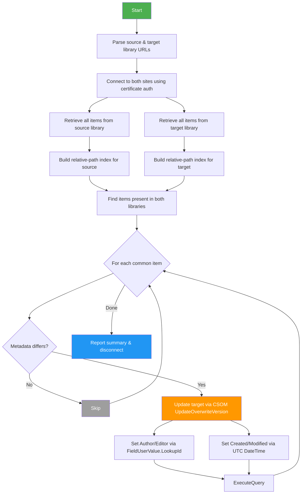

# Sync-LibraryMetadata

Mirrors file and folder metadata between two SharePoint Online document libraries using certificate-based PnP authentication.

**Synced fields:** Author (Created By), Editor (Modified By), Created date, Modified date.

Items are matched by their **relative path** within each library. Items that exist in only one library are silently skipped.

## How It Works



### Technical Details

| Aspect | Approach |
|---|---|
| **User fields** (Author/Editor) | CSOM `FieldUserValue` with `LookupId` — works for regular users *and* system/app accounts (e.g. SharePoint-app) that have no email |
| **Date fields** (Created/Modified) | CSOM with `[DateTime]::SpecifyKind(..., [DateTimeKind]::Utc)` — locale-independent, avoids month/day swap on non-English sites |
| **Update method** | `UpdateOverwriteVersion()` — overwrites system fields without creating a new version |
| **Matching** | Case-insensitive relative path within the library (e.g. `Subfolder/Report.docx`) |
| **Idempotency** | Compares `LookupId` for users and exact `DateTime` for dates; skips items that already match |

## Prerequisites

1. **PowerShell 7+** (recommended) or Windows PowerShell 5.1
2. **PnP.PowerShell** module — the script auto-installs it if missing
3. **Entra ID (Azure AD) App Registration** with a certificate for authentication

## App Registration Setup

### 1. Create the App Registration

1. Go to [Entra ID → App registrations](https://entra.microsoft.com/#view/Microsoft_AAD_RegisteredApps/ApplicationsListBlade) and click **New registration**
2. Name it (e.g. `SPO-MetadataSync`), set **Supported account types** to *Single tenant*
3. Note the **Application (client) ID** and **Directory (tenant) ID**

### 2. Generate & Upload a Certificate

You can use a **self-signed certificate** for development/internal use:

```powershell
# Generate a self-signed cert valid for 2 years
$cert = New-SelfSignedCertificate `
    -Subject "CN=SPO-MetadataSync" `
    -CertStoreLocation "Cert:\CurrentUser\My" `
    -KeyExportPolicy Exportable `
    -KeySpec Signature `
    -KeyLength 2048 `
    -NotAfter (Get-Date).AddYears(2)

# Note the thumbprint
$cert.Thumbprint

# Export the public key (.cer) for uploading to Entra ID
Export-Certificate -Cert $cert -FilePath ".\SPO-MetadataSync.cer"

# (Optional) Export a PFX for use on other machines
$pfxPass = ConvertTo-SecureString -String "YourPfxPassword" -Force -AsPlainText
Export-PfxCertificate -Cert $cert -FilePath ".\SPO-MetadataSync.pfx" -Password $pfxPass
```

Upload the `.cer` file to your app registration under **Certificates & secrets → Certificates → Upload certificate**.

### 3. Grant API Permissions

Under **API permissions**, add the following **Application** permissions and grant admin consent:

| API | Permission | Type |
|---|---|---|
| SharePoint | `Sites.FullControl.All` | Application |

> **Note:** `Sites.FullControl.All` is required because the script writes to system fields (Author, Editor, Created, Modified) which are protected. `Sites.Manage.All` is not sufficient for overwriting these fields.

### 4. Authentication Method

Choose **one** of:

| Method | When to use | Parameter |
|---|---|---|
| **Thumbprint** | Certificate installed in `Cert:\CurrentUser\My` or `Cert:\LocalMachine\My` on the machine running the script | `-Thumbprint "ABC123..."` |
| **PFX file** | Portable — certificate as a file, e.g. for automation servers or different machines | `-PfxPath "C:\certs\mycert.pfx" -PfxPassword "secret"` |

## Usage

### Thumbprint-Based Auth

```powershell
.\Sync-LibraryMetadata.ps1 `
    -SourceUrl "https://contoso.sharepoint.com/sites/SiteA/Shared Documents" `
    -TargetUrl "https://contoso.sharepoint.com/sites/SiteB/Shared Documents" `
    -ClientId  "12345678-1234-1234-1234-123456789abc" `
    -TenantId  "abcdef12-3456-7890-abcd-ef1234567890" `
    -Thumbprint "34CFAA860E5FB8C44335A38A097C1E41EEA206AA"
```

### PFX-Based Auth

```powershell
.\Sync-LibraryMetadata.ps1 `
    -SourceUrl "https://contoso.sharepoint.com/sites/SiteA/Gedeelde documenten" `
    -TargetUrl "https://contoso.sharepoint.com/sites/SiteB/Gedeelde documenten" `
    -ClientId  "12345678-1234-1234-1234-123456789abc" `
    -TenantId  "abcdef12-3456-7890-abcd-ef1234567890" `
    -PfxPath   "C:\certs\SPO-MetadataSync.pfx" `
    -PfxPassword "YourPfxPassword"
```

### Cross-Site Sync

The source and target can be in **different sites** — the script establishes independent connections:

```powershell
.\Sync-LibraryMetadata.ps1 `
    -SourceUrl "https://contoso.sharepoint.com/sites/ProjectA/Shared Documents" `
    -TargetUrl "https://contoso.sharepoint.com/sites/Archive/ProjectA Docs" `
    -ClientId  "12345678-..." `
    -TenantId  "abcdef12-..." `
    -Thumbprint "34CFAA860E..."
```

## Example Output

```
Source site: https://contoso.sharepoint.com/sites/SiteA  |  Library: Shared Documents
Target site: https://contoso.sharepoint.com/sites/SiteB  |  Library: Shared Documents

Connecting to source site...
  Connected.
Connecting to target site...
  Connected.

SOURCE library:
  Retrieving all items from 'Shared Documents' ...
  Found 42 file(s) and 8 folder(s).
TARGET library:
  Retrieving all items from 'Shared Documents' ...
  Found 42 file(s) and 8 folder(s).

Items present in both libraries: 50
Items only in source: 0
Items only in target: 0

  [3/50] Updated (Editor, Modified): Reports/Q4-2025.xlsx
  [17/50] Updated (Author, Created, Modified): Archive/old-proposal.docx

============================================
  Completed in 12.4s
  Updated: 2
  Skipped (already matching): 48
  Errors: 0
============================================
```

## Parameters

| Parameter | Required | Description |
|---|---|---|
| `-SourceUrl` | Yes | Full URL to the source document library |
| `-TargetUrl` | Yes | Full URL to the target document library |
| `-ClientId` | Yes | Entra ID app registration client ID |
| `-TenantId` | Yes | Tenant ID or domain (e.g. `contoso.onmicrosoft.com`) |
| `-Thumbprint` | One of Thumbprint/PfxPath | Certificate thumbprint (installed in local cert store) |
| `-PfxPath` | One of Thumbprint/PfxPath | Path to a `.pfx` certificate file |
| `-PfxPassword` | With PfxPath | Password protecting the PFX file |
| `-BatchSize` | No | Page size for item retrieval (default: `100`) |

## URL Format

The script accepts full library URLs and automatically parses the site URL and library relative path:

| URL | Parsed Site | Parsed Library |
|---|---|---|
| `https://contoso.sharepoint.com/sites/Team/Shared Documents` | `https://contoso.sharepoint.com/sites/Team` | `Shared Documents` |
| `https://contoso.sharepoint.com/sites/Team/Gedeelde%20documenten` | `https://contoso.sharepoint.com/sites/Team` | `Gedeelde documenten` |
| `https://contoso.sharepoint.com/teams/Project/My Library` | `https://contoso.sharepoint.com/teams/Project` | `My Library` |
| `https://contoso.sharepoint.com/Shared Documents` | `https://contoso.sharepoint.com` | `Shared Documents` |

## Troubleshooting

| Issue | Cause | Fix |
|---|---|---|
| `Access denied` or `403` | Insufficient permissions | Ensure the app has `Sites.FullControl.All` with admin consent |
| `The specified certificate could not be found` | Thumbprint not in cert store | Verify with `Get-ChildItem Cert:\CurrentUser\My \| Where-Object Thumbprint -eq "..."` |
| Items keep re-updating on each run | DateTime precision mismatch | Ensure both libraries are on the same SharePoint version; sub-second differences can cause this |
| `No common items found` | Different folder/file structure | Files are matched by relative path — verify the same files exist in both libraries |

## License

Copyright Jos Lieben / Lieben Consultancy — see [license terms](https://www.lieben.nu/liebensraum/commercial-use/).
