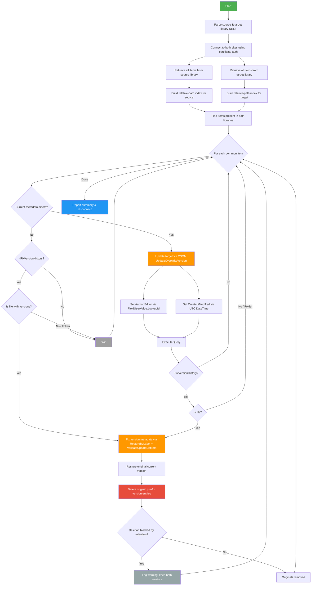

# Sync-LibraryMetadata

Mirrors file and folder metadata between two SharePoint Online document libraries using certificate-based PnP authentication.

**Synced fields:** Author (Created By), Editor (Modified By), Created date, Modified date — on the **current version** by default. With the `-FixVersionHistory` switch, also corrects metadata on all **previous versions**.

Items are matched by their **relative path** within each library. Items that exist in only one library are silently skipped.

## How It Works



### Technical Details

| Aspect | Approach |
|---|---|
| **User fields** (Author/Editor) | CSOM `FieldUserValue` with `LookupId` — works for regular users *and* system/app accounts (e.g. SharePoint-app) that have no email |
| **Date fields** (Created/Modified) | CSOM with `[DateTime]::SpecifyKind(..., [DateTimeKind]::Utc)` — locale-independent, avoids month/day swap on non-English sites |
| **Current version update** | `UpdateOverwriteVersion()` — overwrites system fields without creating a new version |
| **Version history fix** | Only when `-FixVersionHistory` is specified. `RestoreByLabel()` promotes each old version to current → `ValidateUpdateListItem` with `bNewDocumentUpdate=true` overwrites metadata in-place → original current version restored at the end |
| **Version cleanup** | `DeleteByLabel()` removes the original (wrong-metadata) version entries. Best-effort: if a retention policy or compliance hold prevents deletion, the error is logged and the file retains both original and corrected entries |
| **Matching** | Case-insensitive relative path within the library (e.g. `Subfolder/Report.docx`) |
| **Idempotency** | Compares `LookupId` for users and exact `DateTime` for dates; skips items that already match. Versions are compared by Author/Editor only |
| **Cross-site support** | Source and target can be in different site collections; users are resolved via `EnsureUser` and matched by email |

### Version History Correction (`-FixVersionHistory`)

By default, only the **current version's** metadata is synced. When `-FixVersionHistory` is specified, the script also corrects Author and Editor on previous file versions. This is a slower operation because SharePoint Online does not allow direct modification of metadata on previous versions. The script works around this limitation:

1. **For each historical version** whose Author or Editor differs from the source:
   - `RestoreByLabel(versionLabel)` — promotes that version's content to become the current item (creates a new version number)
   - `ValidateUpdateListItem` — overwrites Author, Editor, Created, Modified on the now-current item without creating another version
2. **Restore the original current version** by calling `RestoreByLabel` with the version label that was current before step 1
3. **Clean up** — attempt to delete the original (pre-fix) version entries using `DeleteByLabel`. This removes the stale entries that carried wrong metadata. If a **retention policy** or **compliance hold** blocks deletion, the error is logged as a warning and the script continues. In that case the file will have both the original and the corrected version entries.

> **Note:** This process necessarily creates additional version entries. The cleanup step removes the originals where possible, but retention-locked libraries will retain duplicates.

## Prerequisites

1. **PowerShell 7+** (recommended) or Windows PowerShell 5.1
2. **PnP.PowerShell** module — the script auto-installs it if missing
3. **Entra ID (Azure AD) App Registration** with a certificate for authentication

## App Registration Setup

### 1. Create the App Registration

1. Go to [Entra ID → App registrations](https://entra.microsoft.com/#view/Microsoft_AAD_RegisteredApps/ApplicationsListBlade) and click **New registration**
2. Name it (e.g. `SPO-MetadataSync`), set **Supported account types** to *Single tenant*
3. Note the **Application (client) ID** and **Directory (tenant) ID**

### 2. Generate & Upload a Certificate

You can use a **self-signed certificate** for development/internal use:

```powershell
# Generate a self-signed cert valid for 2 years
$cert = New-SelfSignedCertificate `
    -Subject "CN=SPO-MetadataSync" `
    -CertStoreLocation "Cert:\CurrentUser\My" `
    -KeyExportPolicy Exportable `
    -KeySpec Signature `
    -KeyLength 2048 `
    -NotAfter (Get-Date).AddYears(2)

# Note the thumbprint
$cert.Thumbprint

# Export the public key (.cer) for uploading to Entra ID
Export-Certificate -Cert $cert -FilePath ".\SPO-MetadataSync.cer"

# (Optional) Export a PFX for use on other machines
$pfxPass = ConvertTo-SecureString -String "YourPfxPassword" -Force -AsPlainText
Export-PfxCertificate -Cert $cert -FilePath ".\SPO-MetadataSync.pfx" -Password $pfxPass
```

Upload the `.cer` file to your app registration under **Certificates & secrets → Certificates → Upload certificate**.

### 3. Grant API Permissions

Under **API permissions**, add the following **Application** permissions and grant admin consent:

| API | Permission | Type |
|---|---|---|
| SharePoint | `Sites.FullControl.All` | Application |

> **Note:** `Sites.FullControl.All` is required because the script writes to system fields (Author, Editor, Created, Modified) and deletes version entries, which are both protected operations. `Sites.Manage.All` is not sufficient.

### 4. Authentication Method

Choose **one** of:

| Method | When to use | Parameter |
|---|---|---|
| **Thumbprint** | Certificate installed in `Cert:\CurrentUser\My` or `Cert:\LocalMachine\My` on the machine running the script | `-Thumbprint "ABC123..."` |
| **PFX file** | Portable — certificate as a file, e.g. for automation servers or different machines | `-PfxPath "C:\certs\mycert.pfx" -PfxPassword "secret"` |
| **PFX file (password from file)** | Safest for passwords with special characters | `-PfxPath "..." -PfxPasswordFile "C:\secrets\pfx-pass.txt"` |

## Usage

### Thumbprint-Based Auth

```powershell
.\Sync-LibraryMetadata.ps1 `
    -SourceUrl "https://contoso.sharepoint.com/sites/SiteA/Shared Documents" `
    -TargetUrl "https://contoso.sharepoint.com/sites/SiteB/Shared Documents" `
    -ClientId  "12345678-1234-1234-1234-123456789abc" `
    -TenantId  "abcdef12-3456-7890-abcd-ef1234567890" `
    -Thumbprint "34CFAA860E5FB8C44335A38A097C1E41EEA206AA"
```

### PFX-Based Auth

```powershell
.\Sync-LibraryMetadata.ps1 `
    -SourceUrl "https://contoso.sharepoint.com/sites/SiteA/Gedeelde documenten" `
    -TargetUrl "https://contoso.sharepoint.com/sites/SiteB/Gedeelde documenten" `
    -ClientId  "12345678-1234-1234-1234-123456789abc" `
    -TenantId  "abcdef12-3456-7890-abcd-ef1234567890" `
    -PfxPath   "C:\certs\SPO-MetadataSync.pfx" `
    -PfxPassword "YourPfxPassword"
```

### Cross-Site Sync

The source and target can be in **different sites** — the script establishes independent connections:

```powershell
.\Sync-LibraryMetadata.ps1 `
    -SourceUrl "https://contoso.sharepoint.com/sites/ProjectA/Shared Documents" `
    -TargetUrl "https://contoso.sharepoint.com/sites/Archive/ProjectA Docs" `
    -ClientId  "12345678-..." `
    -TenantId  "abcdef12-..." `
    -Thumbprint "34CFAA860E..."
```

### Including Version History

Add `-FixVersionHistory` to also correct Author/Editor on previous file versions:

```powershell
.\Sync-LibraryMetadata.ps1 `
    -SourceUrl "https://contoso.sharepoint.com/sites/SiteA/Shared Documents" `
    -TargetUrl "https://contoso.sharepoint.com/sites/SiteB/Shared Documents" `
    -ClientId  "12345678-..." `
    -TenantId  "abcdef12-..." `
    -Thumbprint "34CFAA860E..." `
    -FixVersionHistory
```

> **Note:** This is significantly slower as it must restore, update and re-restore each version individually.

### OneDrive for Business

OneDrive personal sites are also supported:

```powershell
.\Sync-LibraryMetadata.ps1 `
    -SourceUrl "https://contoso-my.sharepoint.com/personal/jdoe_contoso_com/Documents" `
    -TargetUrl "https://contoso.sharepoint.com/sites/Archive/Shared Documents" `
    -ClientId  "12345678-..." `
    -TenantId  "abcdef12-..." `
    -PfxPath "C:\certs\mycert.pfx" -PfxPassword "secret"
```

## Example Output

### Current version only (default)

```
Source site: https://contoso.sharepoint.com/sites/SiteA  |  Library: Shared Documents
Target site: https://contoso.sharepoint.com/sites/SiteB  |  Library: Shared Documents

Connecting to source site...
  Connected.
Connecting to target site...
  Connected.

SOURCE library:
  Retrieving all items from 'Shared Documents' ...
  Found 42 file(s) and 8 folder(s).
TARGET library:
  Retrieving all items from 'Shared Documents' ...
  Found 42 file(s) and 8 folder(s).

Items present in both libraries: 50
Items only in source: 0
Items only in target: 0

  [3/50] Updated (Editor, Modified): Reports/Q4-2025.xlsx
  [17/50] Updated (Author, Created, Modified): Archive/old-proposal.docx

============================================
  Completed in 12.4s
  Updated: 2
  Skipped (already matching): 48
  Errors: 0
============================================
```

### With `-FixVersionHistory`

```
  [3/50] Updated (Editor, Modified): Reports/Q4-2025.xlsx
      Fixed version 1.0 metadata
      Fixed version 2.0 metadata
      Deleted original version 1.0
      Deleted original version 2.0
      Restored current version (3.0)
    [3/50] Fixed 2 version(s) metadata, deleted 2 original(s)
  [17/50] Updated (Author, Created, Modified): Archive/old-proposal.docx

============================================
  Completed in 18.7s
  Updated: 2
  Version history entries fixed: 2
  Original versions deleted: 2
  Skipped (already matching): 48
  Errors: 0
============================================
```

> In the example above, versions 1.0 and 2.0 of `Reports/Q4-2025.xlsx` had incorrect Editor metadata. The script corrected both and successfully deleted the original stale entries. If a retention policy had been active, the "Deleted" lines would be warnings instead and the deleted count would be 0.

## Parameters

| Parameter | Required | Description |
|---|---|---|
| `-SourceUrl` | Yes | Full URL to the source document library |
| `-TargetUrl` | Yes | Full URL to the target document library |
| `-ClientId` | Yes | Entra ID app registration client ID |
| `-TenantId` | Yes | Tenant ID or domain (e.g. `contoso.onmicrosoft.com`) |
| `-Thumbprint` | One of Thumbprint/PfxPath | Certificate thumbprint (installed in local cert store) |
| `-PfxPath` | One of Thumbprint/PfxPath | Path to a `.pfx` certificate file |
| `-PfxPassword` | With PfxPath | Password protecting the PFX file |
| `-PfxPasswordFile` | With PfxPath | Path to a plain-text file containing the PFX password (first line is used). Safest for passwords with special characters |
| `-FixVersionHistory` | No | When specified, also corrects Author/Editor on previous file versions. Slower but ensures full version history fidelity |
| `-BatchSize` | No | Page size for item retrieval (default: `100`) |

## URL Format

The script accepts full library URLs and automatically parses the site URL and library relative path:

| URL | Parsed Site | Parsed Library |
|---|---|---|
| `https://contoso.sharepoint.com/sites/Team/Shared Documents` | `https://contoso.sharepoint.com/sites/Team` | `Shared Documents` |
| `https://contoso.sharepoint.com/sites/Team/Gedeelde%20documenten` | `https://contoso.sharepoint.com/sites/Team` | `Gedeelde documenten` |
| `https://contoso.sharepoint.com/teams/Project/My Library` | `https://contoso.sharepoint.com/teams/Project` | `My Library` |
| `https://contoso.sharepoint.com/Shared Documents` | `https://contoso.sharepoint.com` | `Shared Documents` |
| `https://contoso-my.sharepoint.com/personal/jdoe_contoso_com/Documents` | `https://contoso-my.sharepoint.com/personal/jdoe_contoso_com` | `Documents` |

## Troubleshooting

| Issue | Cause | Fix |
|---|---|---|
| `Access denied` or `403` | Insufficient permissions | Ensure the app has `Sites.FullControl.All` with admin consent |
| `The specified certificate could not be found` | Thumbprint not in cert store | Verify with `Get-ChildItem Cert:\CurrentUser\My \| Where-Object Thumbprint -eq "..."` |
| Items keep re-updating on each run | DateTime mismatch | Ensure both sites have the same locale setting |
| `No common items found` | Different folder/file structure | Files are matched by relative path — verify the same files exist in both libraries |
| `Could not delete version X.X (retention policy?)` | Version deletion blocked | A retention policy or compliance hold is active on the target library. The corrected version entry is still present; the original stale entry simply cannot be removed. No action required unless you want to remove the retention policy |
| Version history entries are duplicated | Retention policy prevented cleanup | Expected behavior — the corrected entries carry the right metadata. Remove the retention policy and re-run to clean up, or ignore the duplicates |
| `Could not resolve user '...' on target site` | User doesn't exist in target site | The user from the source site could not be found or created on the target. The field is skipped for that item |

## License

Copyright Jos Lieben / Lieben Consultancy — see [license terms](https://www.lieben.nu/liebensraum/commercial-use/).
